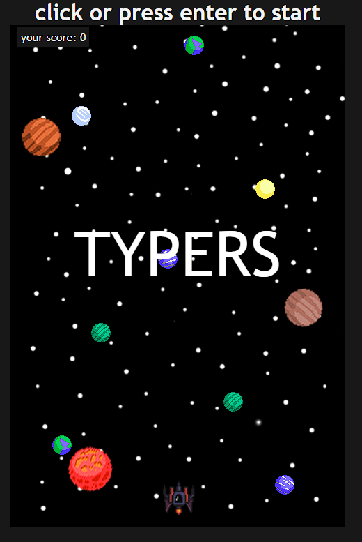
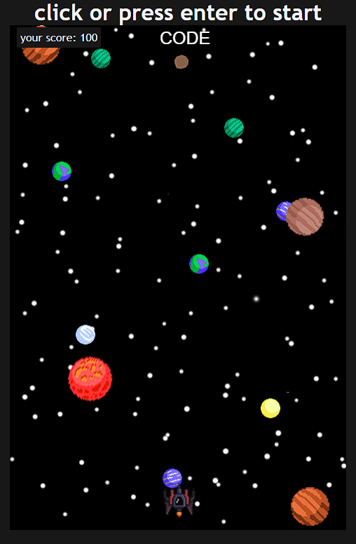
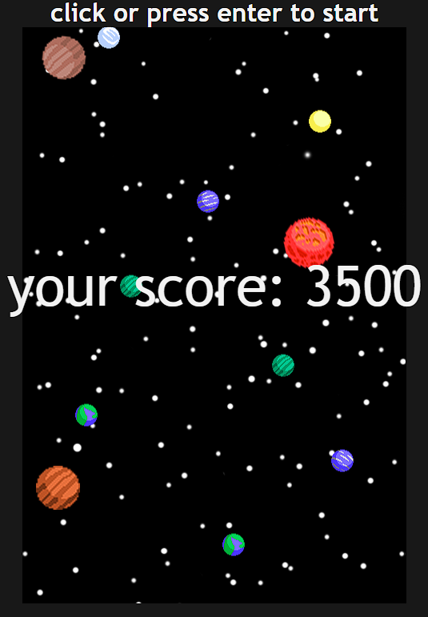

# TyperSpace

This is a JavaScript Typing game builded with vanilla JS and html canvas tag

## Sumary

- [Overview](#overview)
  - [Goals](#metas)
  - [Screenshots](#screenshots)
  - [Links](#links)
- [The Process](#the-process)
  - [Made with](#made-with)
- [Author](#autor)
- [Final considerations](#final-considerations)

## Overview

### Goals

Build a funny typing game wich looks like space invaders

### screenshots

Start

In game

Game Over

### Links

- Link do site: [clique para acessar](https://markoscomk.github.io/TyperSpace/)

## The process

### Made with

- HTML5 canvas element
- CSS3
- Vanilla JavaScript
- OOP

## Autor

- Linkedin - [Markos Soares](https://www.linkedin.com/in/markos-soares/)
- Github - [MarkosComK](https://github.com/MarkosComK)
- Frontend Mentor - [@MarkosComK](https://www.frontendmentor.io/profile/MarkosComK)
- Twitter - [@MarkosComK](https://twitter.com/markoscomk)

## Final considerations

If you want to give me any feedback, tip, feel free to contact-me in any my social medias

Tudo acontece por uma razão e esta existe para me[/te] ajudar.😎

 

   
  
  
 

 